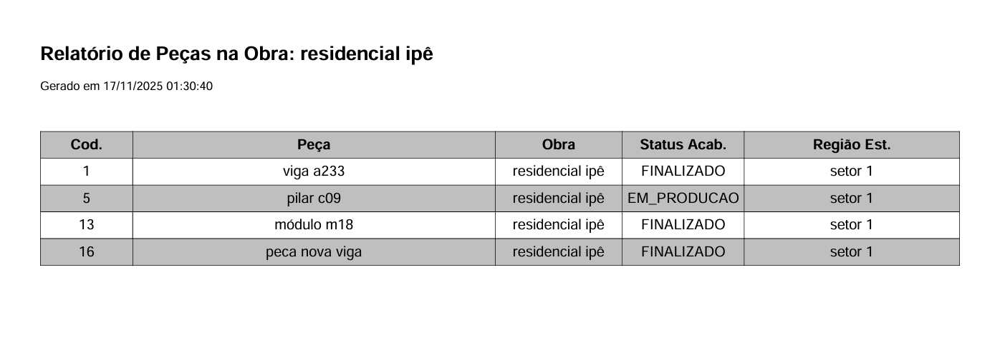

<p align="center">
  
</p>

data_entrega ficou nula -> obra futura às vezes não tem data clara

renomeei os nomes das tabelas para ficarem mais claros
POBRAS -> obras
PJREGPROJETO -> pecas
LGACABAMENTO -> acabamentos
LGESTOQUE -> estoques

além disso acrescentei uma tabela nova chamada "regioes" para substituir o "Regiao" de acabamento e estoque. a razão foi a seguinte: e se eu quiser trocar a região do estoque ou acabamento? Teria que atualizar cada registro de estoque, por exemplo.

usei primary key composta para estoque para evitar duplicidade. poderia ter o mesmo id_peca e id_acabamento em um registro de estoque, mas fazendo ser a primary key isso é evitado

peca tera os status: ATIVA, INATIVA
estoque terá dois estados: AGUARDANDO_ACABAMENTO, EM_ACABAMENTO e DISPONIVEL
acabamento terá três estados: PENDENTE, EM_PRODUCAO e FINALIZADO
adicionei data_fim (quando finaliza) e data_inicio para acabamento

obra terá: ATIVA, CONCLUIDA e INATIVA

MAPEAMENTO:
acabamento = pendente → estoque = aguardando_acabamento
acabamento = em_producao → estoque = em_acabamento
acabamento = finalizado → estoque = disponivel

pensei em fazer a tela de inserir nova peça ou atualizar peça trocando panels, mas achei mais interessante trabalhar com modal

# teste técnico - resumo do projeto

## 1. Criação do banco de dados (SQL Server) ✅

- banco de dados criado conforme o diagrama fornecido. ✅
- diagrama ajustado para corrigir inconsistências e ✅complementar informações faltantes.
- scripts de `INSERT` desenvolvidos para todas as tabelas. ✅
- script de `SELECT` elaborado para apresentar, em uma única linha, as seguintes informações:
  - código de controle ✅
  - nome da peça ✅
  - nome da obra
  - status do acabamento ✅
  - região de estoque ✅

## 2. Desenvolvimento do sistema (C# Windows Forms) ✅

- sistema desenvolvido com dois formulários relacionados ao banco de dados. ✅
- CRUD implementado com `DataGridView` para listar os itens cadastrados. ✅
- filtros implementados por **obra** e **região de estoque**. ✅
- extração de relatório em PDF implementada, incluindo os filtros por obra e região de estoque. ✅

Relacionamento:

```text
[obra] 1 ── n [peca] 1 ── n [acabamento] 1 ── 1 [estoque]
                    \                     /
                     \--- usa regiao ----/
```

<p align="center">
  
</p>

> Ilustração gerada por https://dbdiagram.io

# Setup do Banco de Dados

Você pode criar as tabelas de duas formas: pelo gerenciador de banco ou pelo Docker. Qualquer uma das opções funciona.

---

# Desafio 1

Você terá duas opções para seguir. Uma é executar pelo gerenciador de banco de dados, e a outra com o Docker. Subir o container do docker é opcional caso já tenha o banco de dados

## Opção 1: Com gerenciador de banco

Abra o script `script_create_tables.sql` em uma ferramenta como **Beekeeper Studio**, **DataGrip** ou **SQL Server Management Studio** com banco de dados já existente ou novo e execute ou copie o script, cole e execute. **Faça** o mesmo para `script_insert.sql` e `script_select.sql` de todas as etapas do **desafio 1**

> 1.1, 1.1.1, 1.2 e 1.3 ✅

---

## Opção 2: Com Docker

1. Primeiro suba a imagem do projeto:

```bash
docker-compose up -d
```

2. **Entre** no diretório `Scripts` do projeto.
3. Execute o script no container Docker:

```bash
docker run -it --rm -v "${PWD}:/scripts" --network host mcr.microsoft.com/mssql-tools bash -c "/opt/mssql-tools/bin/sqlcmd -S localhost -U sa -P 'ControlePecas@2025' -d master -i /scripts/script_create_tables.sql"
```

> 1.1 e 1.1.1 ✅

4. Verifique se as tabelas foram criadas

```bash
docker run -it --rm --network host mcr.microsoft.com/mssql-tools bash -c "/opt/mssql-tools/bin/sqlcmd -S localhost -U sa -P 'ControlePecas@2025' -d master -Q 'SELECT name FROM sys.tables;'"
```

5. Popular o banco de dados com items

```bash
docker run -it --rm -v "${PWD}:/scripts" --network host mcr.microsoft.com/mssql-tools bash -c "/opt/mssql-tools/bin/sqlcmd -S localhost -U sa -P 'ControlePecas@2025' -d master -i /scripts/script_insert.sql"

```

> 1.2 ✅

6. Selecionar linha com `código de controle`, `nome da peça`, `nome da obra`,`status do acabamento`, `região de estoque`

```bash
docker run -it --rm -v "${PWD}:/scripts" --network host mcr.microsoft.com/mssql-tools bash -c "/opt/mssql-tools/bin/sqlcmd -S localhost -U sa -P 'ControlePecas@2025' -d master -W -s '|' -i /scripts/script_select.sql"

```

> 1.3 ✅

---

# Desafio 2

Todas as funcionalidades solicitadas foram implementadas e estão funcionando:

- criação do banco de dados com ajustes no diagrama
- scripts de `INSERT` para todas as tabelas
- `SELECT` consolidado com código de controle, nome da peça, nome da obra, status do acabamento e região de estoque
- sistema em c# windows forms com dois formulários
- CRUD completo com `DataGridView`
- filtros por obra e região de estoque
- geração de relatório em PDF com filtros aplicados

### Preview

<div align="center">
  
</div>

- Funcionalidade de gerar relatório funcionando como esperado também. É gerado em documentos em uma pasta chamada "Relatórios".
<p align="center">
  
</p>
